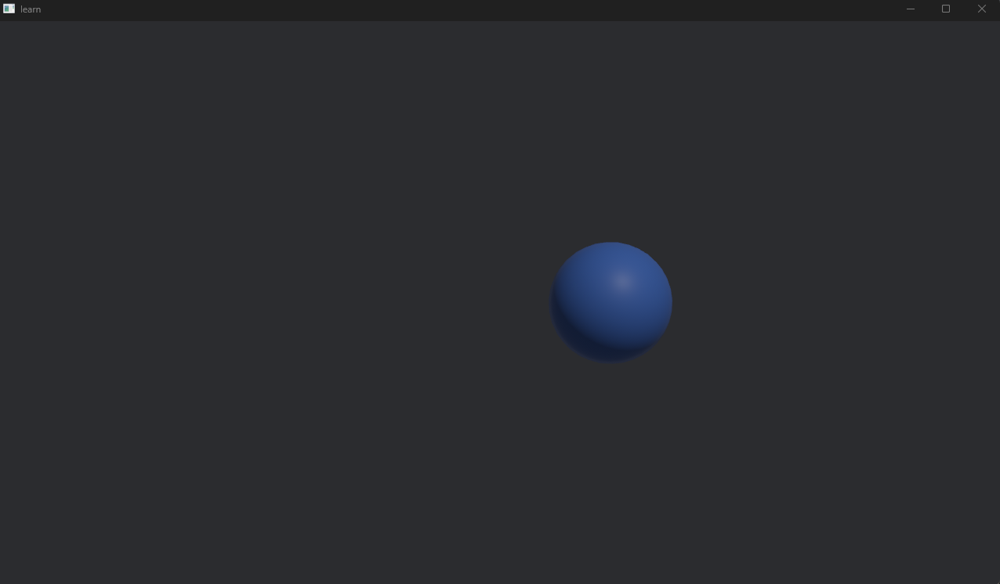

# 惑星を描画してみよう
空のウィンドウの表示に成功したので、中身を入れていきましょう。

## Step1: 惑星を(データ)定義する
コンポーネント(データ)を定義します。Bevyでは、`#[derive(Component)]`をつけた構造体がコンポーネントになります。
```rust
use bevy::prelude::*;

// 位置と速度を定義（Bevyには標準のTransformがありますが、理解のために自作します）
#[derive(Component)]
struct Velocity {
    x: f32,
    y: f32,
    z: f32,
}

// 惑星であることを示すタグ
#[derive(Component)]
struct Planet;

fn main() {
    App::new()
        .add_plugins(DefaultPlugins)
        .add_systems(Startup, setup) // 開始時に一度だけ走るシステム
        .run();
}

// 初期化システム: コマンドを使ってEntityを「Spawn（生成）」します
fn setup(mut commands: Commands) {
    // 1つ目の星を生成
    commands.spawn((
        Planet,
        Velocity { x: 1.0, y: 0.0, z: 0.0 },
        // Bevy標準の位置・回転・拡大縮小を持つコンポーネント
        Transform::from_xyz(0.0, 0.0, 0.0), 
    ));
}
```

3Dモデルを指定していないため、この段階ではまだ画面に何も映りません。ですがメモリ上には「速度と座標を持った何か」が存在しています。

## Step2: 物理法則(システム)を作る
次にシステムです。「Transform(位置)」と「Velocity(速度)」の両方を持っているすべてのEntityを検索し、位置を更新する関数を作ります。
```rust
// Res<Time>: Bevyはで起動した瞬間に内部で時間を管理するストップウォッチを持っているのでそれを使います。
// Query<...> という型を使って、欲しいコンポーネントを指定します
// mut Transform : 位置は書き換えるので mut
// &Velocity     : 速度は読むだけなので &
fn move_objects(time: Res<Time>, mut query: Query<(&mut Transform, &Velocity)>) {
    // query.iter_mut() は条件に合う全Entityを返します（for文で回せます）
    for (mut transform, velocity) in &mut query {
        // デルタタイム（前のフレームからの経過時間）を使って移動
        let dt = time.delta_secs();
        
        transform.translation.x += velocity.x * dt;
        transform.translation.y += velocity.y * dt;
        transform.translation.z += velocity.z * dt;
    }
}
```
そしてmainのAppに登録します
```rust
fn main() {
    App::new()
        .add_plugins(DefaultPlugins)
        .add_systems(Startup, setup)
        .add_systems(Update, move_objects) // 毎フレーム実行するシステムとして登録
        .run();
}
```

## Step3: 描画(3Dメッシュとカメラ)
最後に、画面に球体(惑星)を表示し、それを移すカメラを配置します。<br>
Bevyの3D描画にはMesh(形状)とMaterial(色や質感)が必要です。

setup関数を書き換えます。
```rust
fn setup(
    mut commands: Commands,
    mut meshes: ResMut<Assets<Mesh>>,           // メッシュの倉庫
    mut materials: ResMut<Assets<StandardMaterial>>, // マテリアルの倉庫
) {
    // 1. 惑星を生成
    commands.spawn((
        Planet,
        Velocity { x: 1.0, y: 0.0, z: 0.0 },
        // 3Dモデルの見た目を追加
        Mesh3d(meshes.add(Sphere::new(1.0))), 
        MeshMaterial3d(materials.add(StandardMaterial {
            base_color: Color::srgb(0.3, 0.5, 0.9), // 青っぽい色
            ..default()
        })),
        Transform::from_xyz(0.0, 0.0, 0.0),
    ));

    // 2. カメラを配置（これがないと何も映りません）
    commands.spawn((
        Camera3d::default(),
        Transform::from_xyz(0.0, 5.0, 10.0).looking_at(Vec3::ZERO, Vec3::Y),
    ));

    // 3. 光源（太陽のような光）
    commands.spawn((
        PointLight::default(),
        Transform::from_xyz(4.0, 8.0, 4.0),
    ));
}
```
完成です！実行してみましょう。


このように青っぽい球体が右に移動していくものが描画されたと思います。


## 解説
### ・ResMut<>とRes<>とは
Bevyのデータには大きく分けて2種類あります。
1. Component: Entityにくっつくデータ。世界に何個あってもいい。
2. Resouce:   世界に1つしか存在しないグローバルなデータ。
ResはResouceの略で、システムの引数にこれを書くと、Bevyが自動的にそのグローバルデータを渡してくれます。
- Res<T>: 読み取り専用アクセス(借用)
- ResMut<T>: 書き込み可能アクセス(可変借用)
例えば
```rust
ResMut<Assets<Mesh>>
```
は、「世界に1つしかない『メッシュの倉庫』を書き換え可能で貸してくれ」という意味です。`_Assets<T>_`_: 特定の型Tのアセット（テクスチャ、サウンド、メッシュなど）を格納・管理するためのコンテナ_

### ・commands.spawn()について
- 引数にタプルを取りますが、非常に高い柔軟性を持っており、順番や数は関係ありません。
- ただし、タプルの中に入れられるのは`Component`または`Bundle`(コンポーネントのセット)を実装した型だけです。
- 最大15個くらいまでのタプルの大して自動的に処理が実装されているため、魔法のように動きます。

### ・Vec3とは
Vecはベクトルの略で、
Vec3は(x, y, z) つまり3次元です。
他にもVec2(x, y)もあり、Vec4もありますが、Vec4についてはVec4(r, g, b, a)のようにRGBAとして用いられたり、シェーダー・GPU計算、数学・線形代数用途に用いられます。

### ・カメラのlooking_atのupについて
**カメラの頭のてっぺんがどの方向を向くか** の指定です。
例えば真正面の看板を見るとして(これが第一引数のtarget)、看板を見ながら **首を90ど傾ける** こともできます。そうすると視界は90度回転して見えてしまいます。

カメラも同じで、「どこを見るか」だけでは姿勢が確定しないので、「どっちが上か」を決める必要があります。
`Vec3::Y (0.0, 1.0, 0.0)` : Y軸プラス方向（画面の上）を「空（上）」とする。<br>
これが最も一般的な設定です。もしここを Vec3::X にすると、カメラが横倒しになったような映像になります。宇宙シミュレーションでは「上がない」のでたまにいじることがありますが、基本は Vec3::Y でOKです。