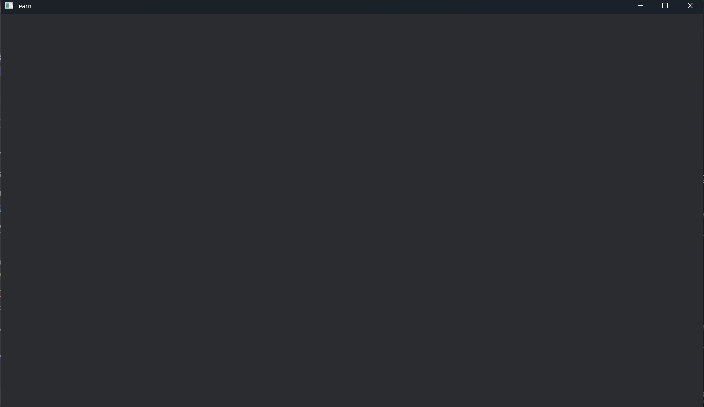

# windowを表示してみよう

以下をコピペしてください
```rust
use bevy::prelude::*;

fn main() {
    App::new()
        .add_plugins(DefaultPlugins)
        .run();
}
```
起動してみましょう(初回は数分かかります)
```bash
cargo run
```
すると、


このようなウィンドウが開けば成功です。
_ウィンドウ名はアプリ名になります。_

## 解説
### App
アプリケーション本体。<br>
BevyではAppというビルダーに、プラグイン(機能の塊)やシステム(関数)を追加して最後にrun()するのが基本形です。

### .add_plugins()
プラグインを追加するためのメソッド。

### DefaultPlugins
**ウィンドウ表示、レンダリング、入力処理、アセット管理** など、Bevyアプリケーションを鵜と化すために通常必要となる基本的な機能をまとめたプラグイン群。