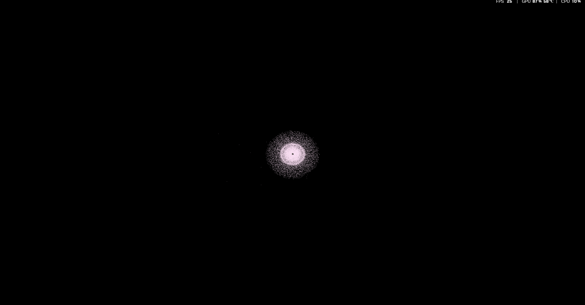

# 惑星(星)を大量に配置してみよう
今回は「乱数」をつかって星をばらまいてみます。
伴う修正が多いのでコードをコピペしてください。
コメントはたくさん置いてあります。

## Step1: 準備
```bash
cargo add rand
```

## Step2: コードの書き換え
```rust
use bevy::prelude::*;
use rand::prelude::*;

// --- コンポーネント ---

// 位置と速度を定義(Transform自作)
#[derive(Component)]
struct Velocity {
    x: f32,
    y: f32,
    z: f32,
}

// 重力の強さ(質量)
#[derive(Component)]
struct Mass {
    value: f32,
}

// 惑星用タグ
#[derive(Component)]
struct Planet;

// 太陽用タグ
#[derive(Component)]
struct Sun;

// カメラ用タグ
#[derive(Component)]
struct MainCamera;

// --- メイン ---
fn main() {
    App::new()
        .insert_resource(ClearColor(Color::BLACK)) // 背景を黒にするため
        .add_plugins(DefaultPlugins)// ウィンドウ、入力、レンダリングなどの基本機能を全部盛り
        .add_systems(Startup, setup) // 開始時に一度だけ走るシステム
        .add_systems(Update, (apply_gravity, move_objects, move_camera).chain())
        .run();
}

// --- システム ---

// 初期化システム: コマンドを使ってEntity生成
fn setup(
    mut commands:   Commands,
    mut meshes:     ResMut<Assets<Mesh>>,               // メッシュの倉庫
    mut materials:  ResMut<Assets<StandardMaterial>>,   // マテリアルの倉庫
) {
    // 共通のメッシュとマテリアルを先に作っておく
    let sphere_mesh = meshes.add(Sphere::new(1.0));
    let sun_mat = materials.add(StandardMaterial {
        base_color: Color::WHITE,
        emissive: LinearRgba::rgb(10.0, 10.0, 0.0), // 発光させる
        ..default()
    });

    let sun_mass = 10000.0; // 重くしてみる

    // 太陽
    commands.spawn((
        Sun,
        Mass { value: sun_mass }, // 切り離した
        Mesh3d(sphere_mesh.clone()),
        MeshMaterial3d(sun_mat),
        Transform::from_xyz(0.0, 0.0, 0.0).with_scale(Vec3::splat(2.0)), // 修正
    ));

    let mut rng = rand::rng();

    let planet_count = 100000; // 星を生成する数

    // 惑星
    for _ in 0..planet_count {
        // --- 位置の決定 ---
        // 太陽からの距離(10.0 ~ 100.0の間でランダム)
        let distance = rng.random_range(10.0..100.0);

        // 角度
        let theta = rng.random_range(0.0..std::f32::consts::TAU);

        // 極座標(距離と角度)から、直交座標(x, z)に変換
        let x = distance * theta.cos();
        let z = distance * theta.sin();
        let y = rng.random_range(-2.0..2.0); // 高さは少しばらけさせる

        let position = Vec3::new(x, y, z);

        // --- 初速の決定(公転させるための物理計算) ---
        // 円軌道を維持するための速度 v = √(GM / r)
        // ※Mass.valueをG*Mと見なしています
        
        // 公転速度の計算 v = √(GM/r)
        let orbital_speed = (sun_mass / distance).sqrt();
        // 太陽への方向ベクトル
        let direction_to_sun = (Vec3::ZERO - position).normalize();
        // 外積を使って「進行方向(接線方向)」を求める
        // (上方向 Y と、太陽への方向の外積をとると、横方向が出る)
        let mut velocity_dir = Vec3::Y.cross(direction_to_sun).normalize();

        // 少しランダム性を足して、完全な円ではなく楕円軌道にする
        let random_speed_factor = rng.random_range(0.8..1.2);
        let velocity = velocity_dir * orbital_speed * random_speed_factor;

        // --- 色の決定 ---
        // 少しずつ違う色にする
        let color = Color::hsla(
            rng.random_range(180.0..280.0), // 青〜紫系の色相
            0.8,
            0.5,
            1.0
        );

        // 星のサイズもランダムに
        let scale = rng.random_range(0.2..0.6);

        // 生成
        commands.spawn((
            Planet,
            Velocity { 
                x: velocity.x, 
                y: velocity.y, 
                z: velocity.z 
            },
            Mesh3d(sphere_mesh.clone()), // メッシュは使い回す（重要！）
            MeshMaterial3d(materials.add(StandardMaterial {
                base_color: color,
                emissive: LinearRgba::rgb(7.0, 2.5, 5.5),
                ..default()
            })),
            
            Transform::from_translation(position).with_scale(Vec3::splat(scale)),
        ));
    }

    // カメラ
    commands.spawn((
        MainCamera,
        Camera3d::default(),
        // 全体が見渡せるように少し遠くへ
        Transform::from_xyz(0.0, 100.0, 50.0).looking_at(Vec3::ZERO, Vec3::Y),
    ));

    // 光源
    commands.spawn((
        PointLight {
            intensity: 2_000_000.0,
            range: 500.0, // 遠くまで届くように
            shadows_enabled: false, // 数が多いときは影を切ると軽くなる
            ..default()
        },
        Transform::from_xyz(0.0, 0.0, 0.0),
    ));
}

// Query<...>型を使って、ほしいコンポーネントを指定
// mut Transform : 位置は書き換えるので mut
// &Velocity     : 速度を読むだけなので &
fn move_objects(time: Res<Time>, mut query: Query<(&mut Transform, &Velocity)>) {
    // query.iter_mut() は条件に合う全Entityを返す。
    for (mut transform, velocity) in &mut query {
        // デルタタイム (前のフレームからの経過時間)を使って移動
        let dt = time.delta_secs();

        transform.translation.x += velocity.x * dt;
        transform.translation.y += velocity.y * dt;
        transform.translation.z += velocity.z * dt;
    }
}

fn apply_gravity(
    time: Res<Time>,
    // 重力源(太陽)の情報を取得：位置と重さが欲しい(書き換えないので & )
    // With<Sun> で「太陽タグが付いているもの」だけに絞り込む
    sun_query: Query<(&Transform, &Mass), With<Sun>>,

    // 惑星の情報を取得：位置と書き換えたい速度を取得
    // With<Planet> で「惑星タグがついているもの」だけに絞り込む
    mut planet_query: Query<(&Transform, &mut Velocity), With<Planet>>,
) {
    // 太陽は1つと仮定して、最初の1個を取得する(なければ何もしない)
    // .single()は「ちょうど1個だけある」時に成功するメソッド
    let Ok((sun_transform, sun_mass)) = sun_query.single() else {
        return;
    };

    let dt = time.delta_secs();

    // 全ての惑星に対して処理を行う
    for (planet_transform, mut planet_velocity) in &mut planet_query {
        // --- ここからベクトル計算 ---

        // 太陽への方向ベクトルと距離を求める (相手の位置 - 自分の位置)
        let diff = sun_transform.translation - planet_transform.translation;
        let distance_sq = diff.length_squared(); // 距離の2乗

        // ゼロ助産や、近づきすぎた時のあらぶりを防ぐガード
        if distance_sq < 0.1 {
            continue;
        }

        // 万有引力の法則っぽい計算
        //    力 F = G * M / r^2 
        //    ここでは定数Gなどは適当に省いて、Mass / 距離の2乗 とする
        let force_magnitude = sun_mass.value / distance_sq;

        // 力をベクトルにする
        // diff.normalize() で「長さ1の方向ベクトル」を作り、それに大きさを掛ける
        let force_vector = diff.normalize() * force_magnitude;

        // 速度に加算する（加速度の適用）
        planet_velocity.x += force_vector.x * dt;
        planet_velocity.y += force_vector.y * dt;
        planet_velocity.z += force_vector.z * dt;
    }
}


// Res<Time>: 時間を知るため
// Res<ButtonInput<KeyCode>>: キーボードの入力状態を知るため
// Query: カメラの Transform を書き換えるため
fn move_camera(
    time: Res<Time>,
    keyboard_input: Res<ButtonInput<KeyCode>>, // キーボード入力のリソース
    // MainCameraタグが付いているEntityのTransformだけを持ってくる
    mut query: Query<&mut Transform, With<MainCamera>>,
) {
    // カメラは1つしかないので、single_mut()で取得
    // もしカメラが0や複数あるとエラーで止まる
    let mut transform = query.single_mut();

    let mut direction = Vec3::ZERO;
    let speed = 100.0; // カメラの移動速度

    // キー入力をチェック(.pressed は「押されている間ずっと」)
    // 現在のカメラは「真下」を見ているので、画面上の動きに合わせて座標を操作する
    // ※LookingAtの設定により通常と変わる。

    // Wキー: 画面上へ
    if keyboard_input.pressed(KeyCode::KeyW) { direction.z -= 1.0; }
    // Aキー: 画面左へ
    if keyboard_input.pressed(KeyCode::KeyA) { direction.x -= 1.0; }
    // Sキー: 画面下へ
    if keyboard_input.pressed(KeyCode::KeyS) { direction.z += 1.0; }
    // Dキー: 画面右へ
    if keyboard_input.pressed(KeyCode::KeyD) { direction.x += 1.0; }

    // Q/Eキーでズーム
    if keyboard_input.pressed(KeyCode::KeyE) { direction.y -= 1.0; }
    if keyboard_input.pressed(KeyCode::KeyQ) { direction.y += 1.0; }

    // 移動量が0より大きければ、正規化して速度と時間を掛ける
    if direction.length_squared() > 0.0 {
        let move_delta = direction.normalize() * speed * time.delta_secs();
        transform.unwrap().translation += move_delta;
    }
}
```

## 実行してみる


引いてみると美しいです