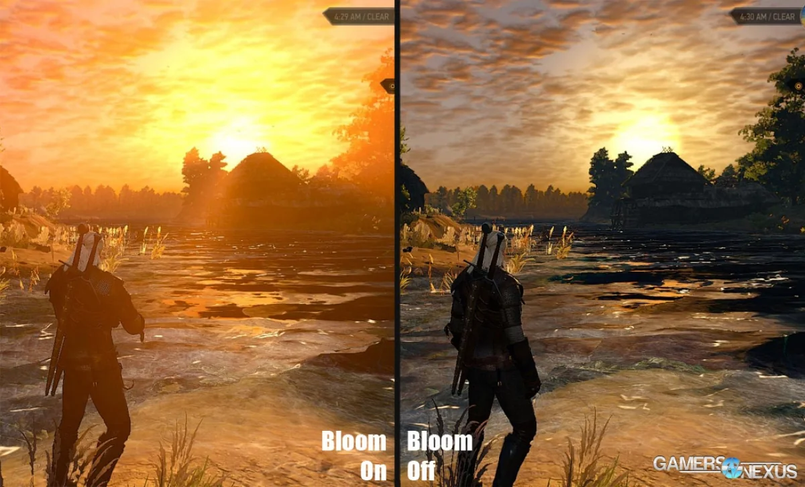
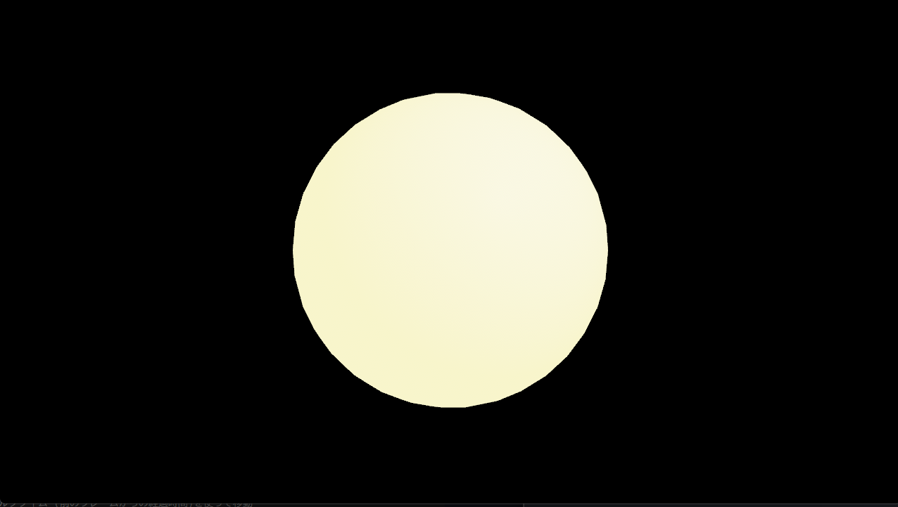
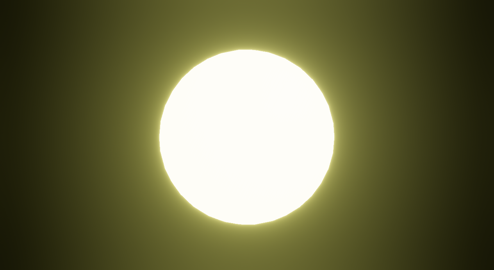
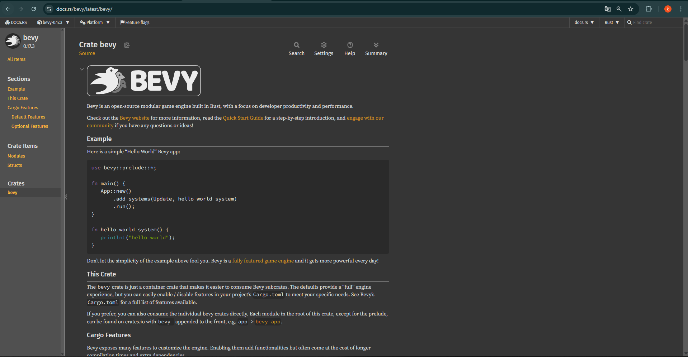
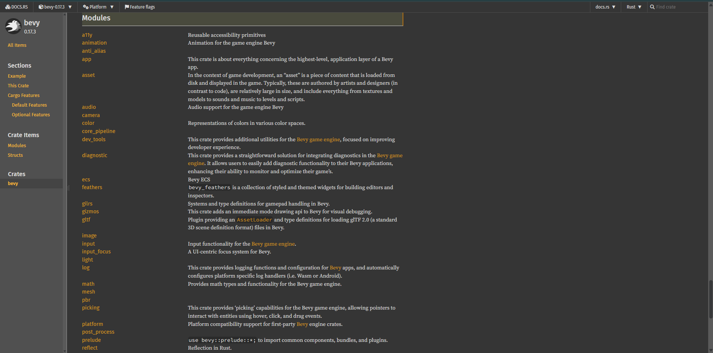
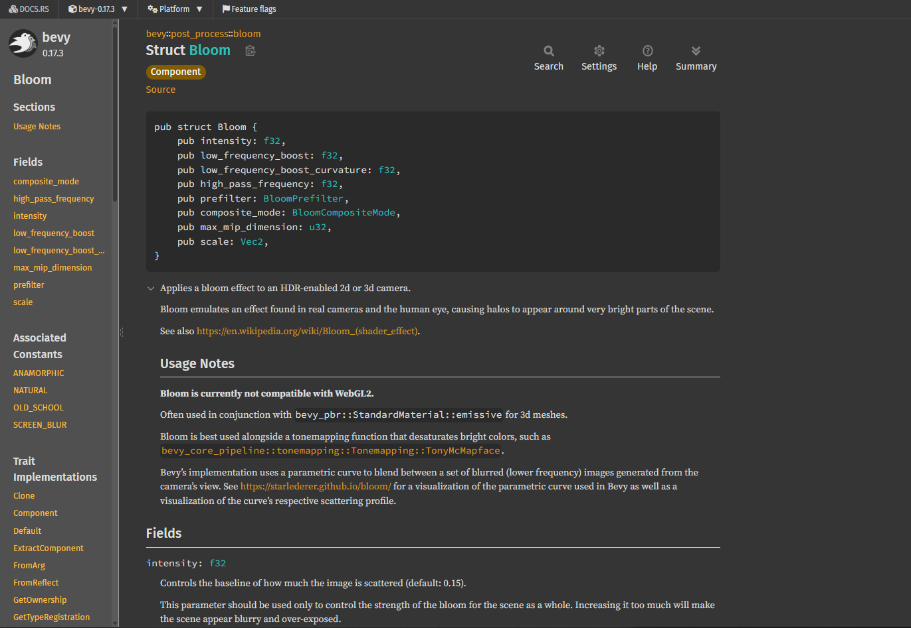
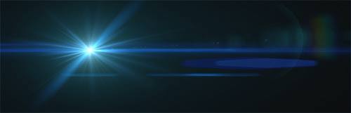
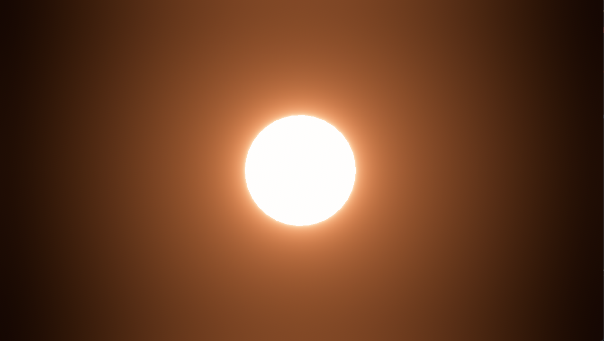
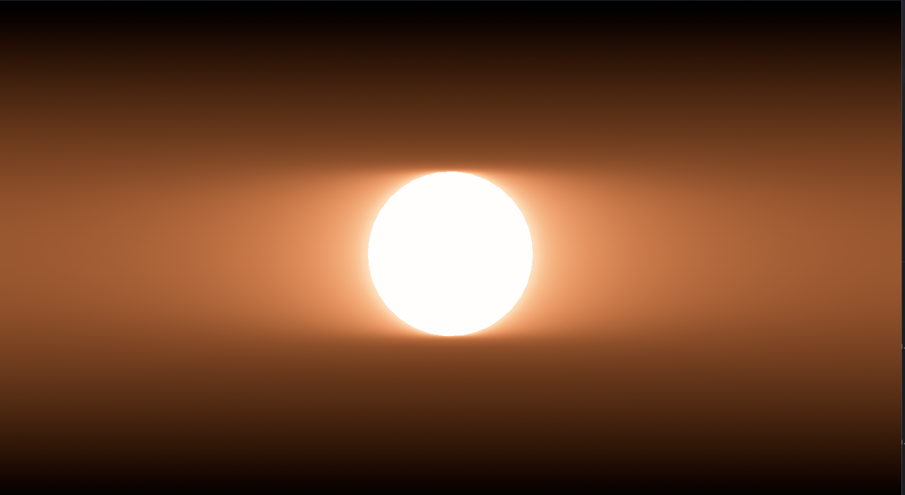
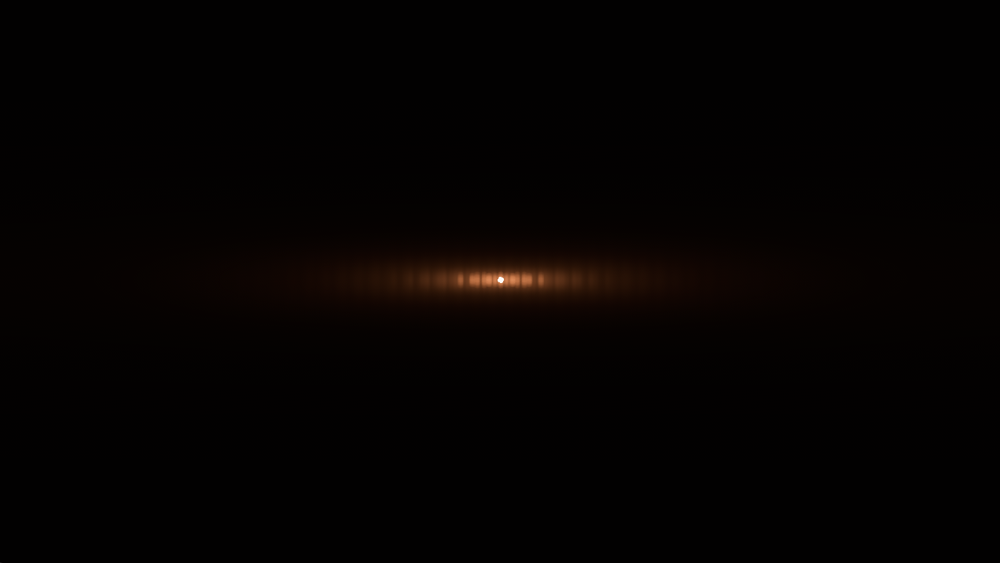

# Bloom

ブルームを実装してみましょう。
ただの白い丸を現実の太陽に寄せてみます。

やることは2つです。

1. カメラの設定: 「このカメラは眩しさを感じ取ります（HDR）」と設定し、「光を溢れさせます（Bloom）」という機能を追加する。
2. 太陽の設定: 「私はただの白ではなく、猛烈に明るい白です」という設定をする。


## Step1: 太陽を実装
まずは基盤となる太陽を作ったのでコピペしてください。
```rust
use bevy::prelude::*;

fn main() {
    App::new()
        .insert_resource(ClearColor(Color::BLACK))
        .add_plugins(DefaultPlugins)
        .add_systems(Startup, setup)
        .run();
}

#[derive(Component)]
struct Sun;

fn setup(
    mut commands: Commands,
    mut meshes: ResMut<Assets<Mesh>>,
    mut materials: ResMut<Assets<StandardMaterial>>, 
) {
    let sun_mat = materials.add(StandardMaterial {
        base_color: Color::WHITE,
        emissive: LinearRgba::rgb(10.0, 10.0, 0.0),
        ..default()
    });

    // 太陽
    commands.spawn((
        Sun,
        Mesh3d(meshes.add(Sphere::new(1.0))),
        MeshMaterial3d(sun_mat),
        Transform::from_xyz(0.0, 0.0, 0.0).with_scale(Vec3::splat(2.0)),
    ));

    // カメラ
    commands.spawn((
        Camera3d::default(),
        Transform::from_xyz(0.0, 0.0, 8.0).looking_at(Vec3::ZERO, Vec3::Y),
    ));

    // ライト
    commands.spawn((
        PointLight {
            intensity: 2_000_000.0,
            shadows_enabled: true,
            ..default()
        },
        Transform::from_xyz(3.0, 3.0, 5.0)
    ));
}
```



## Step2: 必要なモジュールをインポート
```rust
use bevy::core_pipeline::tonemapping::Tonemapping;
use bevy::post_process::bloom::Bloom;
use bevy::render::view::Hdr;
```
大量です。前提として、あくまでBloomはカメラの処理なので、カメラのHDRをオンにする必要がありました。そのためのHdrです。それに加えて、トーンマッピングというHDRを標準的なディスプレイで表示可能にするための技術も使います。でも、Bevyのドキュメントを見るとディスプレイ出力のHDRには対応していないようです。

## Step3: カメラにBloomとHDRを追加
setup 関数の中のカメラ生成部分を、以下のように書き換えます。
```rust
    commands.spawn((
    Camera3d::default(),
    Hdr,
    Tonemapping::TonyMcMapface,
    Bloom::default(),
    Transform::from_xyz(0.0, 0.0, 8.0).looking_at(Vec3::ZERO, Vec3::Y),
```

## Step4: 確認


眩しい！

まあ当然こんなのじゃ満足できません。全力で太陽に寄せていきます。ついでに、ドキュメントの読み方を知りましょう。

## Step5: Bloomのドキュメントを読む
### Step1. Bevy document で検索

### Step2. サイドバーからModulesを選択

### Step3. インポート文を元に特定する
```rust
use bevy::post_process::bloom::Bloom;
```
**post_process → bloom → Bloom**


### Step4. フィールドをざっと確認
上から和訳すると、

- intensity: 強度
- low_frequency_boost: 低周波ブースト
- low_frequency_boost_curvature: 低周波ブーストの曲線
- high_pass_frequency: ハイパス周波数
- prefilter: 前処理フィルタ
- composite_mode: 合成モード
- max_mip_dimension: 最大MIP次元
- scale: スケール

### Step5. 深堀
興味があるのはこれらです
- 低周波ブースト
- 低周波ブーストの曲線
- ハイパス周波数
- 最大MIP次元

まず、言葉から調べていきましょう。低周波ブースト系はなんとなくわかりますが、ハイパス, MIP次元とは何でしょう？

- ハイパス周波数: ある特定の周波数よりも高い周波数成分のみを通し、それよりも低いものは遮断する
- MIP次元: MIP chain textureのことでした。これは、元の高解像度テクスチャ画像に加えて、その解像度を段階的に小さくした複数バージョンを事前に計算・生成したものです。つまり最大MIP次元は、その計算・生成する最大レベルのことでしょう。

### Step6. 各フィールドの解説を見る
#### intensity: f32
```
Controls the baseline of how much the image is scattered (default: 0.15).

This parameter should be used only to control the strength of the bloom for the scene as a whole. Increasing it too much will make the scene appear blurry and over-exposed.

To make a mesh glow brighter, rather than increase the bloom intensity, you should increase the mesh’s emissive value.

In energy-conserving mode
The value represents how likely the light is to scatter.

The value should be between 0.0 and 1.0 where:

0.0 means no bloom
1.0 means the light is scattered as much as possible
In additive mode
The value represents how much scattered light is added to the image to create the glow effect.

In this configuration:

0.0 means no bloom
Greater than 0.0 means a proportionate amount of scattered light is added
```
すべて読む必要はないでしょう。読み取れることをピックアップするならば、

- デフォルトは0.15
- 最大1.0
- メッシュをより明るくしたいならemissive value
- エネルギー保存モード?では、光が錯乱する可能性の高さを表す

どうやらフィールドの`composite_mode`がエネルギー保存モードが指すもののようです。ただ今のところよくわからないので飛ばしましょう。

#### prefilter
これは興味深いです。
```
Controls the threshold filter used for extracting the brightest regions from the input image before blurring them and compositing back onto the original image.

Changing these settings creates a physically inaccurate image and makes it easy to make the final result look worse. However, they can be useful when emulating the 1990s-2000s game look. See BloomPrefilter for more information.
```
input imageが何を指すのかよくわかりませんが、とにかく _make the final result look worse.**However, they can be useful when emulating the 1990s-2000s game look.**_ ということです。後ほど実験してみましょう。

#### composite_mode
思ったより深く解説されていませんでした。エネルギー保存ってのがマジでわからないけど、とりあえずデフォルトにします。

#### max_mip_dimension
ノイズが見えた時のみにいじるものだそう。

#### scale
Vec2各軸(x, y)方向へのブルーム効果を拡大する倍率だそうで、芸術的な表現に有用？x値を大きくするとアナモルフィックブラーの再現に使えるそう。
アナモルフィックブラーはこれらしい


### Step7. 実験
#### intencity
```rust
use bevy::prelude::*;
use bevy::core_pipeline::tonemapping::Tonemapping;
use bevy::post_process::bloom::Bloom;
use bevy::render::view::Hdr;

fn main() {
    App::new()
        .insert_resource(ClearColor(Color::BLACK))
        .add_plugins(DefaultPlugins)
        .add_systems(Startup, setup)
        .run();
}

#[derive(Component)]
struct Sun;

fn setup(
    mut commands: Commands,
    mut meshes: ResMut<Assets<Mesh>>,
    mut materials: ResMut<Assets<StandardMaterial>>, 
) {
    let sun_mat = materials.add(StandardMaterial {
        base_color: Color::WHITE,
       emissive: LinearRgba::rgb(253.0, 70.0, 20.0), // 赤に寄せた
        ..default()
    });

    // 太陽
    commands.spawn((
        Sun,
        Mesh3d(meshes.add(Sphere::new(1.0))),
        MeshMaterial3d(sun_mat),
        Transform::from_xyz(0.0, 0.0, 0.0).with_scale(Vec3::splat(2.0)),
    ));

    // カメラ
    commands.spawn((
    Camera3d::default(),
    Hdr,
    Tonemapping::TonyMcMapface, 
    Bloom {
        intensity: 1.0,
        ..Default::default()
    },
    Transform::from_xyz(0.0, 0.0, 15.0).looking_at(Vec3::ZERO, Vec3::Y), // 引いた
));


    // ライト
    commands.spawn((
        PointLight {
            intensity: 2_000_000.0,
            shadows_enabled: true,
            ..default()
        },
        Transform::from_xyz(3.0, 3.0, 5.0)
    ));
}
```

コピペしてください。まずはintensity(強度)の実験です。もちろんマックスで行きます。


激しすぎました。



どうでしょう？これは0.2です。デフォルトと差は少ないですがこれで行きましょう。

#### prefilter
これまたドキュメントを深堀しましたがよくわかりませんでした。
しかし、BloomPrefilter構造体を引数にとり、そのフィールドはどちらもf32で1.0がMaxで、デフォルトは0.0でした。なので1.0/0.5でやってみます。

結論のみ書くと、 ~~レトロ風を期待したが~~ 何も変化は見られませんでした。また今度別のケースで試しましょう。

#### scale
アナモルフィックブラーを見てみましょう。
```rust
    commands.spawn((
    Camera3d::default(),
    Hdr,
    Tonemapping::TonyMcMapface, 
    Bloom {
        intensity: 0.2,
        scale: Vec2::new(5.0, 0.0),
        ..Default::default()
    },
    Transform::from_xyz(0.0, 0.0, 15.0).looking_at(Vec3::ZERO, Vec3::Y),
));
```


なるほど。予想通りです。もっと際立てさせます。

```rust
    commands.spawn((
    Camera3d::default(),
    Hdr,
    Tonemapping::TonyMcMapface, 
    Bloom {
        intensity: 0.4,
        scale: Vec2::new(15.0, -2.0),
        ..Default::default()
    },
    Transform::from_xyz(0.0, 0.0, 500.0).looking_at(Vec3::ZERO, Vec3::Y),
));
```



どうですか？なにかロマンを感じます。<br>
y軸をマイナスにすると若干おかしくなりますが、これもまた良いです。

本題は太陽の再現でしたが、逸れてしまいました。が、Bloomについてしっかり学ぶことができました。