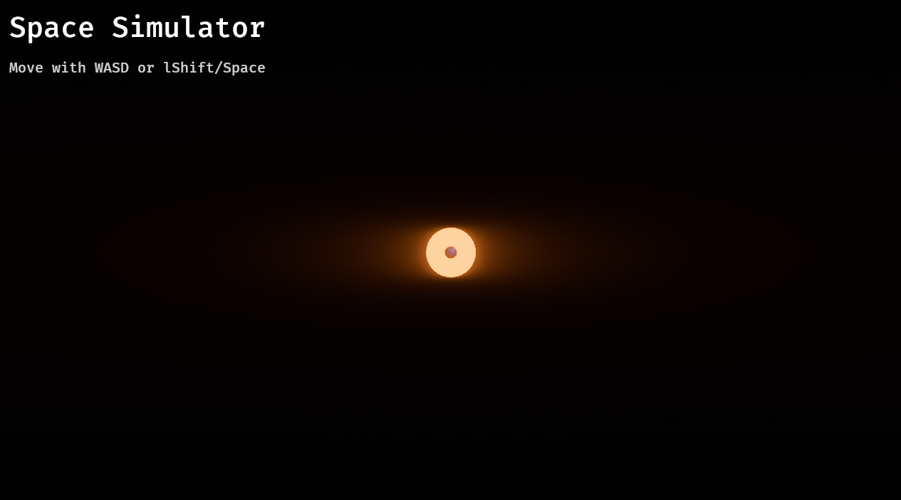

# 基本の配置とテキスト表示
BevyのUIはHTML/CSSのFlexboxに近い仕組みを採用して扱いやすいです。

## Bevy UIの基本概念
BevyのUIも、エンティティと同じようにcommands.spawnで生成しますが、使うコンポーネントが違います。以下の3つが重要です。

1. Node: 箱（divタグのようなもの）。サイズや並び方を決めます。
2. Text / TextFont / TextColor: 文字そのもの。
3. Parent / Children: 親子関係。大きな箱の中に小さな文字やボタンを入れます。

## 実装
以下のコードを最下部に追加してください。
```rust
// UIセットアップ用システム
fn setup_ui(mut commands: Commands) {
    // 1. UIの全体を覆うルートノード(透明な板)を作成
    commands.spawn((
        // Nodeコンポーネントでレイアウトを設定
        Node {
            // 画面いっぱい
            width: Val::Percent(100.0),
            height: Val::Percent(100.0),
            // 子要素(テキストなど)の配置設定
            // FlexDirection::Columnにすると縦並び、Rowだと横並び
            flex_direction: FlexDirection::Column,
            // 水平方向の位置(FlexStart=左, Center=中央, FlexEnd=右)
            align_items: AlignItems::FlexStart,
            // 垂直方向の位置
            justify_content: JustifyContent::FlexStart,
            ..default()
        },
        // 今回は使わないが、ここで背景色などを指定することもできる
    ))
    // 2. その中に子要素を追加
    .with_children(|parent| {
        // タイトルテキスト
        parent.spawn((
            // テキストの内容
            Text::new("宇宙シミュレーター"),
            // フォント設定
            TextFont {
                font_size: 40.0,
                ..default()
            },
            // 文字色
            TextColor(Color::WHITE),
            // テキスト自体のレイアウト
            Node {
                // 左上と上に少しマージンを入れる
                margin: UiRect::all(Val::Px(20.0)),
                ..default()
            },
        ));

        // サブタイトル
        parent.spawn((
            Text::new("WASDで前後左右に移動\nSpace/LCtrlで上下に移動"),
            TextFont {
                font_size: 20.0,
                ..default()
            },
            TextColor(Color::srgb(0.8, 0.8, 0.8)), // 少しグレー
            Node {
                margin: UiRect::left(Val::Px(20.0)), // 左だけ余白
                ..default()
            },
        ));
    });
}
```
```rust
.add_systems(Startup, (setup, setup_ui)) // 登録
```

## 実行


左上に文字が表示されました！