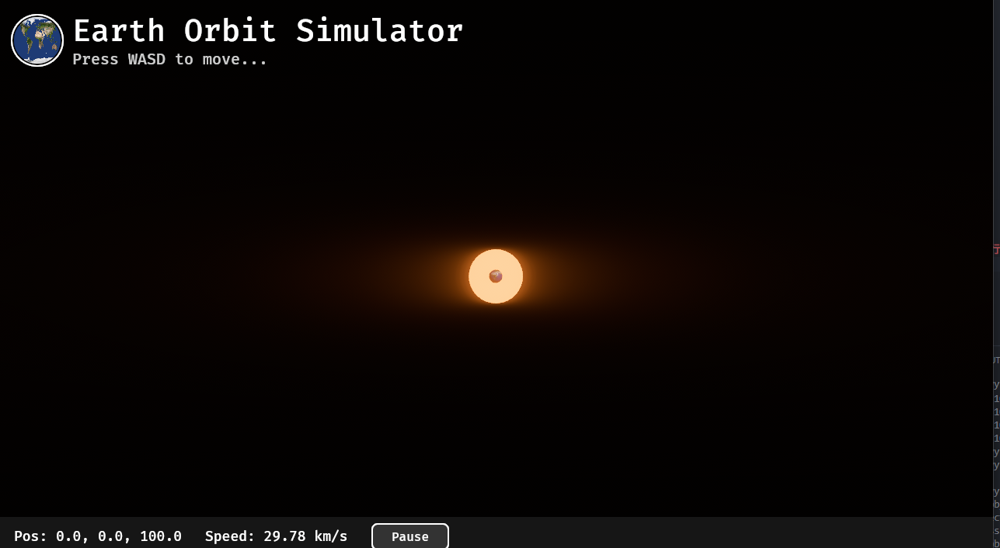

# 仕上げと装飾
UIに画像（アイコン）を表示して、見た目をリッチに仕上げましょう。

今回は、すでにある earth.png を、UI上のタイトル横に「アイコン」として表示し、丸く切り抜く（BorderRadius） 装飾を行います。

### 今回の目標
タイトル「Earth Orbit Simulator」の左横に、地球の画像をアイコンとして表示する。

画像を正円（丸）に切り抜く。

## Step1: システム引数の変更
setup_ui 関数の中で画像をロードする必要が出てきたので、引数に AssetServer を追加します。
```rust
// 引数に asset_server を追加
fn setup_ui(mut commands: Commands, asset_server: Res<AssetServer>) {
    // 画像を読み込み
    let icon_image = asset_server.load("earth.png");

    // ... (以下変更なし)
```

## Step2: UIに画像ノードを追加
タイトルの横に画像を並べるために、ヘッダー部分（「上部エリア」）の構造を少し変えます。 現状は FlexDirection::Column（縦並び）ですが、アイコンとタイトルを並べるために、その中に Row（横並び）の箱を作ります。

setup_ui の中、// 1. 上部エリア（ヘッダー）のグループ の部分を以下のように書き換えてください。
```rust
// ==================================================
        // 1. 上部エリア（ヘッダー）のグループ
        // ==================================================
        parent.spawn((
            Node {
                flex_direction: FlexDirection::Row, // ★アイコンとテキストを横並びにするためRowに変更
                align_items: AlignItems::Center,    // 縦方向の中央揃え
                padding: UiRect::all(Val::Px(20.0)),
                column_gap: Val::Px(15.0),          // アイコンと文字の間隔
                ..default()
            },
        )).with_children(|header| {
            // ★追加: 地球アイコン
            header.spawn((
                // 画像を表示するコンポーネント (Bevy 0.15以降の書き方)
                ImageNode::new(icon_image),
                Node {
                    width: Val::Px(60.0),  // サイズ指定
                    height: Val::Px(60.0),
                    ..default()
                },
                // 丸く切り抜くための設定
                BorderRadius::all(Val::Percent(50.0)), 
                // 必要なら枠線もつけられます
                BorderColor(Color::WHITE),
                Outline {
                    width: Val::Px(2.0),
                    offset: Val::Px(2.0),
                    color: Color::WHITE,
                }
            ));

            // ★タイトルとサブタイトルをまとめる縦並びの箱
            header.spawn((
                Node {
                    flex_direction: FlexDirection::Column,
                    ..default()
                },
            )).with_children(|text_group| {
                 // タイトル
                 text_group.spawn((
                    Text::new("Earth Orbit Simulator"),
                    TextFont { font_size: 40.0, ..default() },
                    TextColor(Color::WHITE),
                ));
                // サブタイトル
                text_group.spawn((
                    Text::new("Press WASD to move..."),
                    TextFont { font_size: 20.0, ..default() },
                    TextColor(Color::srgb(0.8, 0.8, 0.8)),
                ));
            });
        });
```

## 実行


素晴らしい！