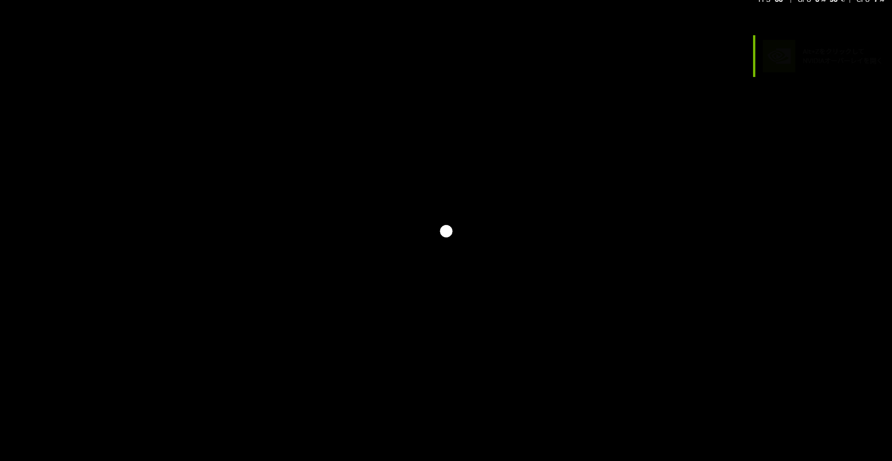

# 純粋に実装してみよう
## コンポーネント定義
```rust
use bevy::prelude::*;

#[derive(Component)]
struct Sun;

#[derive(Component)]
struct Mercury;

#[derive(Component)]
struct Venus;

#[derive(Component)]
struct Earth;

#[derive(Component)]
struct Mars;

#[derive(Component)]
struct Jupiter;

#[derive(Component)]
struct Saturn;

#[derive(Component)]
struct Uranus;

#[derive(Component)] 
struct Neptune;
```
大量です。

## テーブルを元に定数定義
```rust
// [相対サイズ, x, y, z]
const SUN:     [f32; 4] =   [109.0, 0.0,   0.0, 0.0];
const MERCURY: [f32; 4] =   [0.38,  0.32,  0.0, 0.0];
const VENUS:   [f32; 4] =   [0.95,  0.72,  0.0, 0.0];
const EARTH:   [f32; 4] =   [1.00,  1.00,  0.0, 0.0];
const MARS:    [f32; 4] =   [0.53,  1.52,  0.0, 0.0];
const JUPITER: [f32; 4] =   [11.21, 5.20,  0.0, 0.0];
const SATURN:  [f32; 4] =   [9.45,  9.54,  0.0, 0.0];
const URANUS:  [f32; 4] =   [4.01,  19.19, 0.0, 0.0];
const NEPTUNE: [f32; 4] =   [3.88,  30.07, 0.0, 0.0];

```

## main, setup
```rust
fn main() {
    App::new()
        .add_plugins(DefaultPlugins)
        .add_systems(Startup, setup)
        .run();
}

fn setup(
    mut commands: Commands,
    mut meshes: ResMut<Assets<Mesh>>, 
    mut materials: ResMut<Assets<StandardMaterial>>,
) {
    // 太陽
    commands.spawn((
        Sun,
        Mesh3d(meshes.add(Sphere::new(1.0))),
        MeshMaterial3d(materials.add(StandardMaterial {
            base_color: Color::WHITE,
            ..default()
        })),
        Transform:: from_xyz(SUN[1], SUN[2], SUN[3]).with_scale(Vec3::splat(SUN[0]))
    ));

    // 水星
    commands.spawn((
        Mercury,
        Mesh3d(meshes.add(Sphere::new(1.0))),
        MeshMaterial3d(materials.add(StandardMaterial {
            base_color: Color::WHITE,
            ..default()
        })),
        Transform:: from_xyz(MERCURY[1], MERCURY[2], MERCURY[3]).with_scale(Vec3::splat(MERCURY[0]))
    ));

    // 金星
    commands.spawn((
        Venus,
        Mesh3d(meshes.add(Sphere::new(1.0))),
        MeshMaterial3d(materials.add(StandardMaterial {
            base_color: Color::WHITE,
            ..default()
        })),
        Transform:: from_xyz(VENUS[1], VENUS[2], VENUS[3]).with_scale(Vec3::splat(VENUS[0]))
    ));

    // 地球
    commands.spawn((
        Earth,
        Mesh3d(meshes.add(Sphere::new(1.0))),
        MeshMaterial3d(materials.add(StandardMaterial {
            base_color: Color::WHITE,
            ..default()
        })),
        Transform:: from_xyz(EARTH[1], EARTH[2], EARTH[3]).with_scale(Vec3::splat(EARTH[0]))
    ));

    // 火星
    commands.spawn((
        Mars,
        Mesh3d(meshes.add(Sphere::new(1.0))),
        MeshMaterial3d(materials.add(StandardMaterial {
            base_color: Color::WHITE,
            ..default()
        })),
        Transform:: from_xyz(MARS[1], MARS[2], MARS[3]).with_scale(Vec3::splat(MARS[0]))
    ));

    // 木星
    commands.spawn((
        Jupiter,
        Mesh3d(meshes.add(Sphere::new(1.0))),
        MeshMaterial3d(materials.add(StandardMaterial {
            base_color: Color::WHITE,
            ..default()
        })),
        Transform:: from_xyz(JUPITER[1], JUPITER[2], JUPITER[3]).with_scale(Vec3::splat(JUPITER[0]))
    ));

    // 土星
    commands.spawn((
        Saturn,
        Mesh3d(meshes.add(Sphere::new(1.0))),
        MeshMaterial3d(materials.add(StandardMaterial {
            base_color: Color::WHITE,
            ..default()
        })),
        Transform:: from_xyz(SATURN[1], SATURN[2], SATURN[3]).with_scale(Vec3::splat(SATURN[0]))
    ));

    // 天王星
    commands.spawn((
        Uranus,
        Mesh3d(meshes.add(Sphere::new(1.0))),
        MeshMaterial3d(materials.add(StandardMaterial {
            base_color: Color::WHITE,
            ..default()
        })),
        Transform:: from_xyz(URANUS[1], URANUS[2], URANUS[3]).with_scale(Vec3::splat(URANUS[0]))
    ));

    // 海王星
    commands.spawn((
        Neptune,
        Mesh3d(meshes.add(Sphere::new(1.0))),
        MeshMaterial3d(materials.add(StandardMaterial {
            base_color: Color::WHITE,
            ..default()
        })),
        Transform:: from_xyz(NEPTUNE[1], NEPTUNE[2], NEPTUNE[3]).with_scale(Vec3::splat(NEPTUNE[0]))
    ));


    commands.spawn((
        Camera3d::default(),
        Projection::Perspective(PerspectiveProjection {
            far: 10_000_000.0,
            ..default()
        }),
        Transform::from_xyz(0.0, 5000.0, 0.0).looking_at(Vec3::ZERO, Vec3::Y),
    ));
}
```

## 確認


上から見下ろした様子ですが、当然ですが、太陽に他の惑星が埋まってしまってます。大きさの単位と距離の単位が分けられていないからです。つまり、`Size:1.0 ≠ X:1.0`というわけです。

Geminiに相談してみました。
サマリーとしては、

- 現実の宇宙では、1天文単位（太陽〜地球の距離）は、地球半径の約23,455倍
- つまり地球のサイズを基準（1.0）にするなら、距離には 23455.0 を掛ける必要がある
- 天文学単位に小さい値を掛けることで統一して圧縮させるべき

## 修正
天文学単位を設け、距離にかけてみます。
諸々修正したのでコピペしてください。
```rust
use bevy::prelude::*;

#[derive(Component)]
struct Sun;

#[derive(Component)]
struct Mercury;

#[derive(Component)]
struct Venus;

#[derive(Component)]
struct Earth;

#[derive(Component)]
struct Mars;

#[derive(Component)]
struct Jupiter;

#[derive(Component)]
struct Saturn;

#[derive(Component)]
struct Uranus;

#[derive(Component)] 
struct Neptune;

// 天文学単位
const ASTRONOMICAL_UNIT: f32 = 23455.0;

// [相対サイズ, x, y, z]
const SUN:     [f32; 4] =   [109.0, 0.0 * ASTRONOMICAL_UNIT,   0.0, 0.0];
const MERCURY: [f32; 4] =   [0.38,  0.32 * ASTRONOMICAL_UNIT,  0.0, 0.0];
const VENUS:   [f32; 4] =   [0.95,  0.72 * ASTRONOMICAL_UNIT,  0.0, 0.0];
const EARTH:   [f32; 4] =   [1.00,  1.00 * ASTRONOMICAL_UNIT,  0.0, 0.0];
const MARS:    [f32; 4] =   [0.53,  1.52 * ASTRONOMICAL_UNIT,  0.0, 0.0];
const JUPITER: [f32; 4] =   [11.21, 5.20 * ASTRONOMICAL_UNIT,  0.0, 0.0];
const SATURN:  [f32; 4] =   [9.45,  9.54 * ASTRONOMICAL_UNIT,  0.0, 0.0];
const URANUS:  [f32; 4] =   [4.01,  19.19 * ASTRONOMICAL_UNIT, 0.0, 0.0];
const NEPTUNE: [f32; 4] =   [3.88,  30.07 * ASTRONOMICAL_UNIT, 0.0, 0.0]; 

fn main() {
    App::new()
        .insert_resource(ClearColor(Color::BLACK))
        .add_plugins(DefaultPlugins)
        .add_systems(Startup, setup)
        .run();
}

fn setup(
    mut commands: Commands,
    mut meshes: ResMut<Assets<Mesh>>, 
    mut materials: ResMut<Assets<StandardMaterial>>,
) {
    // 太陽
    commands.spawn((
        Sun,
        Mesh3d(meshes.add(Sphere::new(1.0))),
        MeshMaterial3d(materials.add(StandardMaterial {
            base_color: Color::WHITE,
            emissive: LinearRgba::rgb(256.0, 256.0, 256.0),
            ..default()
        })),
        Transform:: from_xyz(SUN[1], SUN[2], SUN[3]).with_scale(Vec3::splat(SUN[0]))
    ));

    // 水星
    commands.spawn((
        Mercury,
        Mesh3d(meshes.add(Sphere::new(1.0))),
        MeshMaterial3d(materials.add(StandardMaterial {
            base_color: Color::WHITE,
            emissive: LinearRgba::rgb(256.0, 256.0, 256.0),
            ..default()
        })),
        Transform:: from_xyz(MERCURY[1], MERCURY[2], MERCURY[3]).with_scale(Vec3::splat(MERCURY[0]))
    ));

    // 金星
    commands.spawn((
        Venus,
        Mesh3d(meshes.add(Sphere::new(1.0))),
        MeshMaterial3d(materials.add(StandardMaterial {
            base_color: Color::WHITE,
            emissive: LinearRgba::rgb(256.0, 256.0, 256.0),
            ..default()
        })),
        Transform:: from_xyz(VENUS[1], VENUS[2], VENUS[3]).with_scale(Vec3::splat(VENUS[0]))
    ));

    // 地球
    commands.spawn((
        Earth,
        Mesh3d(meshes.add(Sphere::new(1.0))),
        MeshMaterial3d(materials.add(StandardMaterial {
            base_color: Color::WHITE,
            emissive: LinearRgba::rgb(256.0, 256.0, 256.0),
            ..default()
        })),
        Transform:: from_xyz(EARTH[1], EARTH[2], EARTH[3]).with_scale(Vec3::splat(EARTH[0]))
    ));

    // 火星
    commands.spawn((
        Mars,
        Mesh3d(meshes.add(Sphere::new(1.0))),
        MeshMaterial3d(materials.add(StandardMaterial {
            base_color: Color::WHITE,
            emissive: LinearRgba::rgb(256.0, 256.0, 256.0),
            ..default()
        })),
        Transform:: from_xyz(MARS[1], MARS[2], MARS[3]).with_scale(Vec3::splat(MARS[0]))
    ));

    // 木星
    commands.spawn((
        Jupiter,
        Mesh3d(meshes.add(Sphere::new(1.0))),
        MeshMaterial3d(materials.add(StandardMaterial {
            base_color: Color::WHITE,
            emissive: LinearRgba::rgb(256.0, 256.0, 256.0),
            ..default()
        })),
        Transform:: from_xyz(JUPITER[1], JUPITER[2], JUPITER[3]).with_scale(Vec3::splat(JUPITER[0]))
    ));

    // 土星
    commands.spawn((
        Saturn,
        Mesh3d(meshes.add(Sphere::new(1.0))),
        MeshMaterial3d(materials.add(StandardMaterial {
            base_color: Color::WHITE,
            emissive: LinearRgba::rgb(256.0, 256.0, 256.0),
            ..default()
        })),
        Transform:: from_xyz(SATURN[1], SATURN[2], SATURN[3]).with_scale(Vec3::splat(SATURN[0]))
    ));

    // 天王星
    commands.spawn((
        Uranus,
        Mesh3d(meshes.add(Sphere::new(1.0))),
        MeshMaterial3d(materials.add(StandardMaterial {
            base_color: Color::WHITE,
            emissive: LinearRgba::rgb(256.0, 256.0, 256.0),
            ..default()
        })),
        Transform:: from_xyz(URANUS[1], URANUS[2], URANUS[3]).with_scale(Vec3::splat(URANUS[0]))
    ));

    // 海王星
    commands.spawn((
        Neptune,
        Mesh3d(meshes.add(Sphere::new(1.0))),
        MeshMaterial3d(materials.add(StandardMaterial {
            base_color: Color::WHITE,
            emissive: LinearRgba::rgb(256.0, 256.0, 256.0),
            ..default()
        })),
        Transform:: from_xyz(NEPTUNE[1], NEPTUNE[2], NEPTUNE[3]).with_scale(Vec3::splat(NEPTUNE[0]))
    ));


    commands.spawn((
        Camera3d::default(),
        Projection::Perspective(PerspectiveProjection {
            far: 100_000_000.0,
            ..default()
        }),
        Transform::from_xyz(0.0, 10000.0, 0.0).looking_at(Vec3::ZERO, Vec3::Y),
    ));
}
```

## 確認(非圧縮)


はい、全然写りません。圧縮しようかなと思いましたが。一旦これで行きましょう。この虚無感や再現困難なスケール感もロマンです。