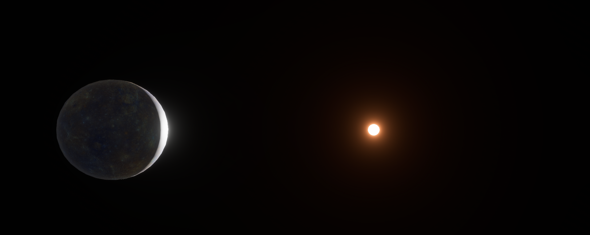
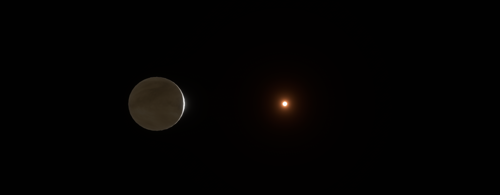
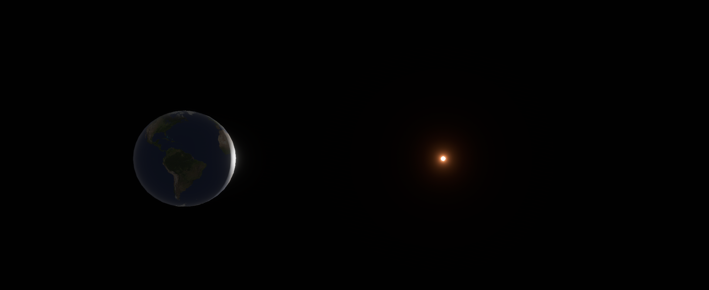
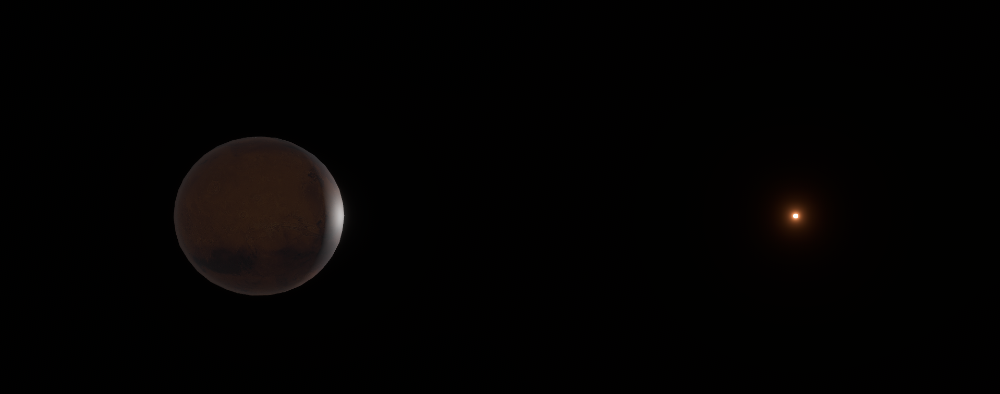
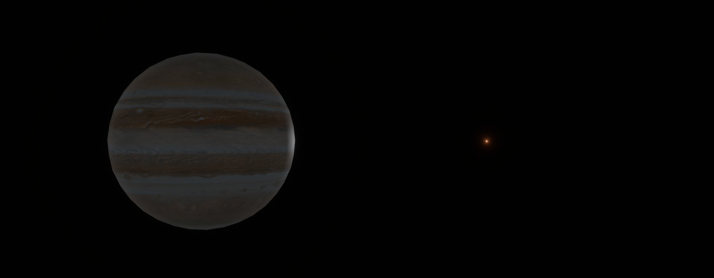
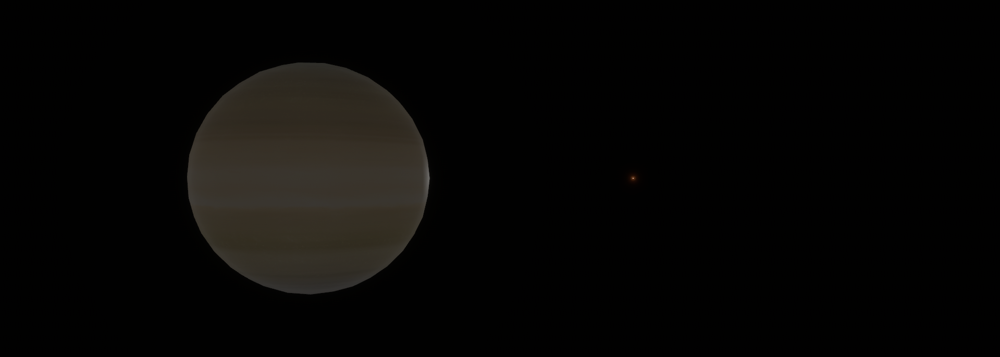
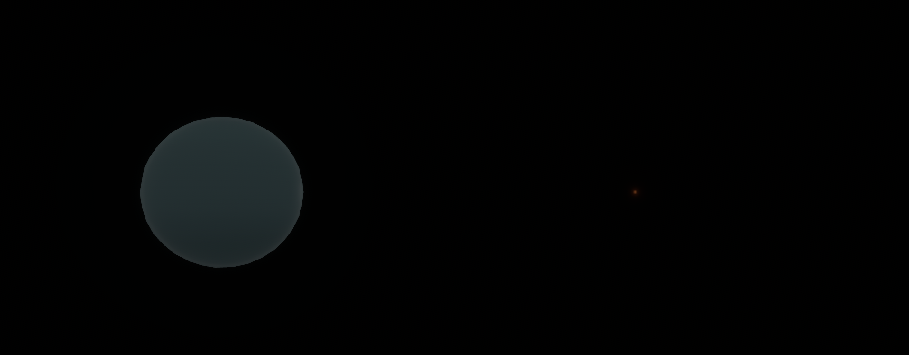
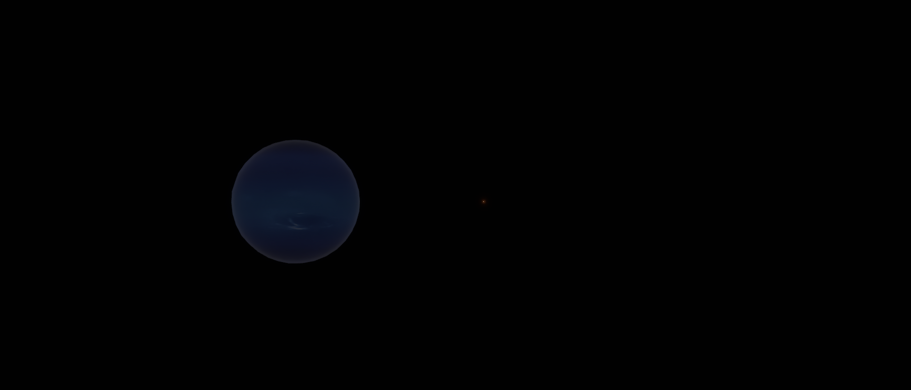

# 見た目を本物に寄せよう
[各惑星のテクスチャマップはこちらから](https://drive.google.com/drive/folders/1Yzz_bd7QrRntJlTDw0W6TIWAKdAea4-j?usp=drive_link)

## コード全体
```rust
use bevy::{core_pipeline::tonemapping::Tonemapping, prelude::*};
use bevy::post_process::bloom::Bloom;
use bevy::render::view::Hdr;

// カメラ
#[derive(Component)]
struct MainCamera;

// カメラ座標用
#[derive(Component)]
struct CameraPositionText;

// スピードメーター用
#[derive(Component)]
struct Speedometer {
    current_speed_units_per_sec: f32,
    last_position: Vec3,
}

#[derive(Component)]
struct SpeedText;

// 自転コンポーネント
#[derive(Component)]
struct Rotator {
    speed: f32,
}

// カメラ速度
#[derive(Resource)]
struct CameraSpeed(f32);

#[derive(Component)]
struct Sun;

#[derive(Component)]
struct Mercury;

#[derive(Component)]
struct Venus;

#[derive(Component)]
struct Earth;

#[derive(Component)]
struct Mars;

#[derive(Component)]
struct Jupiter;

#[derive(Component)]
struct Saturn;

#[derive(Component)]
struct Uranus;

#[derive(Component)] 
struct Neptune;

// match用
#[derive(Component, Clone, Copy, Debug)]
enum Planet {
    SUN, MERCURY, VENUS, EARTH, MARS, JUPITER, SATURN, URANUS, NEPTUNE 
}

#[derive(Component)]
struct PlanetButton(Planet);

// 天文学単位
const AU_KM: f32 = 149_597_870.0;
const AU_UNITS: f32 = 23_455.0; 

// [相対サイズ, x, y, z]
const SUN:     [f32; 4] =   [109.0, 0.0 * AU_UNITS,   0.0, 0.0];
const MERCURY: [f32; 4] =   [0.38,  0.32 * AU_UNITS,  0.0, 0.0];
const VENUS:   [f32; 4] =   [0.95,  0.72 * AU_UNITS,  0.0, 0.0];
const EARTH:   [f32; 4] =   [1.00,  1.00 * AU_UNITS,  0.0, 0.0];
const MARS:    [f32; 4] =   [0.53,  1.52 * AU_UNITS,  0.0, 0.0];
const JUPITER: [f32; 4] =   [11.21, 5.20 * AU_UNITS,  0.0, 0.0];
const SATURN:  [f32; 4] =   [9.45,  9.54 * AU_UNITS,  0.0, 0.0];
const URANUS:  [f32; 4] =   [4.01,  19.19 * AU_UNITS, 0.0, 0.0];
const NEPTUNE: [f32; 4] =   [3.88,  30.07 * AU_UNITS, 0.0, 0.0];

// 単位変換（地球半径スケール）
const KM_PER_UNIT: f32 = AU_KM / AU_UNITS; // ≒ 6378
const UNIT_S_TO_KMH: f32 = KM_PER_UNIT * 3600.0;

fn main() {
    App::new()
        .insert_resource(ClearColor(Color::BLACK))
        .insert_resource(CameraSpeed(30.0))
        .add_plugins(DefaultPlugins)
        .add_systems(Startup, (setup, setup_ui))
        .add_systems(Update, (planet_button_system, move_camera, rotate_planet, update_pos, update_speedometer, update_speed_ui))
        .run();
}

fn setup(
    mut commands: Commands,
    mut meshes: ResMut<Assets<Mesh>>, 
    mut materials: ResMut<Assets<StandardMaterial>>,
    asset_server: Res<AssetServer>,
) {
    let sun_texture = asset_server.load("sun.png");
    let mercury_texture = asset_server.load("mercury.png");
    let venus_texture = asset_server.load("venus.png");
    let earth_texture = asset_server.load("earth.png");
    let mars_texture = asset_server.load("mars.png");
    let jupiter_texture = asset_server.load("jupiter.png");
    let saturn_texture = asset_server.load("saturn.png");
    let uranus_texture = asset_server.load("uranus.png");
    let neptune_texture = asset_server.load("neptune.png");

    // 太陽
    commands.spawn((
        Sun,
        Rotator { speed: 0.02 },
        Mesh3d(meshes.add(Sphere::new(1.0))),
        MeshMaterial3d(materials.add(StandardMaterial {
            base_color: Color::WHITE,
            base_color_texture: Some(sun_texture),
            emissive: LinearRgba::rgb(253.0, 70.0, 20.0),
            ..default()
        })),
        Transform:: from_xyz(SUN[1], SUN[2], SUN[3]).with_scale(Vec3::splat(SUN[0]))
    ));

    // 水星
    commands.spawn((
        Mercury,
        Rotator { speed: 0.0008 },
        Mesh3d(meshes.add(Sphere::new(1.0))),
        MeshMaterial3d(materials.add(StandardMaterial {
            base_color: Color::WHITE,
            base_color_texture: Some(mercury_texture),
            emissive: LinearRgba::rgb(0.0, 0.0, 0.0),
            ..default()
        })),
        Transform:: from_xyz(MERCURY[1], MERCURY[2], MERCURY[3]).with_scale(Vec3::splat(MERCURY[0]))
    ));

    // 金星
    commands.spawn((
        Venus,
        Rotator { speed: 0.0002 },
        Mesh3d(meshes.add(Sphere::new(1.0))),
        MeshMaterial3d(materials.add(StandardMaterial {
            base_color: Color::WHITE,
            base_color_texture: Some(venus_texture),
            emissive: LinearRgba::rgb(0.0, 0.0, 0.0),
            ..default()
        })),
        Transform:: from_xyz(VENUS[1], VENUS[2], VENUS[3]).with_scale(Vec3::splat(VENUS[0]))
    ));

    // 地球
    commands.spawn((
        Earth,
        Rotator { speed: 0.5 },
        Mesh3d(meshes.add(Sphere::new(1.0))),
        MeshMaterial3d(materials.add(StandardMaterial {
            base_color: Color::WHITE,
            base_color_texture: Some(earth_texture),
            emissive: LinearRgba::rgb(0.0, 0.0, 0.0),
            ..default()
        })),
        Transform:: from_xyz(EARTH[1], EARTH[2], EARTH[3]).with_scale(Vec3::splat(EARTH[0]))
    ));

    // 火星
    commands.spawn((
        Mars,
        Rotator { speed: 0.55 },
        Mesh3d(meshes.add(Sphere::new(1.0))),
        MeshMaterial3d(materials.add(StandardMaterial {
            base_color: Color::WHITE,
            base_color_texture: Some(mars_texture),
            emissive: LinearRgba::rgb(0.0, 0.0, 0.0),
            ..default()
        })),
        Transform:: from_xyz(MARS[1], MARS[2], MARS[3]).with_scale(Vec3::splat(MARS[0]))
    ));

    // 木星
    commands.spawn((
        Jupiter,
        Rotator { speed: 1.2 },
        Mesh3d(meshes.add(Sphere::new(1.0))),
        MeshMaterial3d(materials.add(StandardMaterial {
            base_color: Color::WHITE,
            base_color_texture: Some(jupiter_texture),
            emissive: LinearRgba::rgb(0.0, 0.0, 0.0),
            ..default()
        })),
        Transform:: from_xyz(JUPITER[1], JUPITER[2], JUPITER[3]).with_scale(Vec3::splat(JUPITER[0]))
    ));

    // 土星
    commands.spawn((
        Saturn,
        Rotator { speed: 1.15 },
        Mesh3d(meshes.add(Sphere::new(1.0))),
        MeshMaterial3d(materials.add(StandardMaterial {
            base_color: Color::WHITE,
            base_color_texture: Some(saturn_texture),
            emissive: LinearRgba::rgb(0.0, 0.0, 0.0),
            ..default()
        })),
        Transform:: from_xyz(SATURN[1], SATURN[2], SATURN[3]).with_scale(Vec3::splat(SATURN[0]))
    ));

    // 天王星
    commands.spawn((
        Uranus,
        Rotator { speed: 0.65 },
        Mesh3d(meshes.add(Sphere::new(1.0))),
        MeshMaterial3d(materials.add(StandardMaterial {
            base_color: Color::WHITE,
            base_color_texture: Some(uranus_texture),
            emissive: LinearRgba::rgb(0.0, 0.0, 0.0),
            ..default()
        })),
        Transform:: from_xyz(URANUS[1], URANUS[2], URANUS[3]).with_scale(Vec3::splat(URANUS[0]))
    ));

    // 海王星
    commands.spawn((
        Neptune,
        Rotator { speed: 0.8 },
        Mesh3d(meshes.add(Sphere::new(1.0))),
        MeshMaterial3d(materials.add(StandardMaterial {
            base_color: Color::WHITE,
            base_color_texture: Some(neptune_texture),
            emissive: LinearRgba::rgb(0.0, 0.0, 0.0),
            ..default()
        })),
        Transform:: from_xyz(NEPTUNE[1], NEPTUNE[2], NEPTUNE[3]).with_scale(Vec3::splat(NEPTUNE[0]))
    ));

    // カメラ
    commands.spawn((
        Speedometer {
            current_speed_units_per_sec: 0.0,
            last_position: Vec3::new(1000.0, 0.0, 0.0),
        },
        MainCamera,
        Camera3d::default(),
        Hdr,
        Tonemapping::TonyMcMapface,
        Bloom {
            intensity: 0.1,
            ..default()
        },
        Projection::Perspective(PerspectiveProjection {
            far: 1_000_000.0,
            ..default()
        }),
        Transform::from_xyz(1000.0, 0.0, 0.0).looking_at(Vec3::ZERO, Vec3::Y),
    ));

    // ライト
    commands.spawn((
        PointLight {
            intensity: 25_000_000_000_000.0,
            range: 1_000_000.0,
            radius: 109.0,
            shadows_enabled: true,
            ..default()
        },
        Transform::from_xyz(0.0, 0.0, 0.0)
    ));
}

// 惑星を自転させるシステム
fn rotate_planet(time: Res<Time>, mut query: Query<(&mut Transform, &Rotator)>) {
    let dt = time.delta_secs();

    for (mut transform, rotator) in &mut query {
        transform.rotate_y(rotator.speed * dt);
    }
}

// 移動
fn move_camera(
    time: Res<Time>,
    keyboard_input: Res<ButtonInput<KeyCode>>,
    mut camera_speed: ResMut<CameraSpeed>,
    mut query: Query<&mut Transform, With<MainCamera>>,
) {
    if let Ok(mut transform) = query.single_mut() {
        let move_speed = camera_speed.0;
        let rotate_speed = 1.0;

        // --- 回転処理 ---
        if keyboard_input.pressed(KeyCode::KeyQ) {
            transform.rotate_axis(Dir3::Y, rotate_speed * time.delta_secs());
        }
        if keyboard_input.pressed(KeyCode::KeyE) {
            transform.rotate_axis(Dir3::Y, -rotate_speed * time.delta_secs());
        }

        // --- 移動処理 ---
        let mut movement = Vec3::ZERO;
        let local_forward = transform.forward();
        let local_right = transform.right();

        if keyboard_input.pressed(KeyCode::KeyW) { movement += *local_forward; }
        if keyboard_input.pressed(KeyCode::KeyS) { movement -= *local_forward; }
        if keyboard_input.pressed(KeyCode::KeyD) { movement += *local_right; }
        if keyboard_input.pressed(KeyCode::KeyA) { movement -= *local_right; }
        if keyboard_input.pressed(KeyCode::ControlLeft) { movement -= Vec3::Y; }
        if keyboard_input.pressed(KeyCode::Space) { movement += Vec3::Y; }

        // --- オプション ---
        if keyboard_input.pressed(KeyCode::Digit0) { camera_speed.0 = 1.0; }
        if keyboard_input.pressed(KeyCode::Digit1) { camera_speed.0 = 5.0; }
        if keyboard_input.pressed(KeyCode::Digit2) { camera_speed.0 = 15.0; }
        if keyboard_input.pressed(KeyCode::Digit3) { camera_speed.0 = 30.0; }
        if keyboard_input.pressed(KeyCode::Digit4) { camera_speed.0 = 90.0; }
        if keyboard_input.pressed(KeyCode::Digit5) { camera_speed.0 = 150.0; } // 地球から太陽まで2分35秒
        if keyboard_input.pressed(KeyCode::Digit6) { camera_speed.0 = 250.0; }
        if keyboard_input.pressed(KeyCode::Digit7) { camera_speed.0 = 1000.0; }
        if keyboard_input.pressed(KeyCode::Digit8) { camera_speed.0 = 10000.0; }
        if keyboard_input.pressed(KeyCode::Digit9) { camera_speed.0 = 100000.0; }

        if movement.length_squared() > 0.0 {
            let delta = movement.normalize() * move_speed * time.delta_secs();
            transform.translation += delta;
        }
    }
}

fn update_speedometer(
    time: Res<Time>,
    // 計測対象（カメラやプレイヤーなど）
    mut query: Query<(&Transform, &mut Speedometer)>, 
) {
    let dt = time.delta_secs();
    if dt == 0.0 { return; } // ゼロ除算防止

    for (transform, mut meter) in &mut query {
        // 移動距離を計算 (今の位置 - 前の位置)
        let distance_moved = transform.translation.distance(meter.last_position);

        // 秒速を計算 (距離 / 時間) -> これで「Bevelの1単位/秒」が出る
        let speed_per_sec = distance_moved / dt;

        meter.current_speed_units_per_sec = speed_per_sec;

        // 前回の位置を更新（次フレームのために保存）
        meter.last_position = transform.translation;
    }
}

// スピードメーターUI
fn update_speed_ui(
    meter_query: Query<&Speedometer, With<Camera>>, 
    mut text_query: Query<&mut Text, With<SpeedText>>, 
) {
    if let Ok(meter) = meter_query.single() {
        let speed_kmh = meter.current_speed_units_per_sec * UNIT_S_TO_KMH;

        for mut text in &mut text_query {
            text.0 = format!("{:.0} km/h", speed_kmh);
        }
    }
}

// UIセットアップ用システム
fn setup_ui(mut commands: Commands) {
    commands.spawn((
        Node {
            width: Val::Percent(100.0),
            height: Val::Percent(100.0),
            flex_direction: FlexDirection::Column,
            justify_content: JustifyContent::End, 
            ..default()
        },
    ))
    .with_children(|parent| {
        parent.spawn((
            Text::new("Pos: 0.0, 0.0, 0.0"),
            TextFont { font_size: 18.0, ..default() },
            TextColor(Color::WHITE),
            CameraPositionText, 
        ));

        parent.spawn((
            Text::new("0.0km/h"),
            TextFont { font_size: 18.0, ..default() },
            TextColor(Color::WHITE),
            SpeedText,
        ));

        let planets = [
            (Planet::SUN,     "Sun"),
            (Planet::MERCURY, "Mercury"),
            (Planet::VENUS,   "Venus"),
            (Planet::EARTH,   "Earth"),
            (Planet::MARS,    "Mars"),
            (Planet::JUPITER, "Jupiter"),
            (Planet::SATURN,  "Saturn"),
            (Planet::URANUS,  "Uranus"),
            (Planet::NEPTUNE, "Neptune")
        ];

        parent.spawn((
            Node {
                width: Val::Percent(100.0),
                height: Val::Px(50.0), 
                flex_direction: FlexDirection::Row, 
                align_items: AlignItems::Center,
                justify_content: JustifyContent::FlexStart,
                padding: UiRect::horizontal(Val::Px(20.0)),
                column_gap: Val::Px(30.0), 
                overflow: Overflow::clip_x(),
                ..default()
            },
            BackgroundColor(Color::srgba(0.1, 0.1, 0.1, 0.5)),
        ))
        .with_children(|footer| {
            for (planet_type, label) in planets {
                footer.spawn((
                    Button,
                    Node {
                        padding: UiRect::all(Val::Px(10.0)),
                        border: UiRect::all(Val::Px(2.0)),
                        ..default()
                    },
                    BackgroundColor(Color::srgb(0.2, 0.2, 0.2)),
                    PlanetButton(planet_type), 
                ))
                .with_children(|button| {
                    button.spawn((
                        Text::new(label),
                        TextFont { font_size: 16.0, ..default() },
                        TextColor(Color::WHITE),
                    ));
                });
            }
        });
    });
}

// 座標更新
fn update_pos(
    camera_query: Single<&Transform, With<MainCamera>>,
    mut text_query: Single<&mut Text, With<CameraPositionText>>,
) {
    let pos = camera_query.translation;
    text_query.0 = format!("Pos: {:.0}, {:.0}, {:.0}", pos.x, pos.y, pos.z);
}

// ボタンの見た目とカメラ位置などを処理
fn planet_button_system(
    mut interaction_query: Query<
        (&Interaction, &mut BackgroundColor, &PlanetButton),
        (Changed<Interaction>, With<Button>),
    >,
    mut camera_query: Query<&mut Transform, With<MainCamera>>,
) {
    let Ok(mut camera_transform) = camera_query.single_mut() else { return };

    for (interaction, mut bg_color, planet_button) in &mut interaction_query {
        match *interaction {
            Interaction::Pressed => {
                *bg_color = Color::srgb(0.1, 0.5, 0.1).into();
                let target_pos = get_planet_position(planet_button.0);

                // 太陽の時は引き目にする
                let offset = if target_pos == Vec3::ZERO {
                    Vec3::new(1000.0, 0.0, 0.0)
                } else {
                    Vec3::new(100.0, 0.0, 0.0)
                };

                // 対象の惑星に視線を合わせる
                *camera_transform = Transform::from_translation(target_pos + offset)
                    .looking_at(target_pos, Vec3::Y);
            }
            Interaction::Hovered => {
                *bg_color = Color::srgb(0.3, 0.3, 0.3).into();
            }
            Interaction::None => {
                *bg_color = Color::srgb(0.2, 0.2, 0.2).into();
            }
        }
    }
}

// 引数に渡された惑星の座標を返す
fn get_planet_position(planet: Planet) -> Vec3 {
    let data = match planet {
        Planet::SUN     => SUN,
        Planet::MERCURY => MERCURY,
        Planet::VENUS   => VENUS,
        Planet::EARTH   => EARTH,
        Planet::MARS    => MARS,
        Planet::JUPITER => JUPITER,
        Planet::SATURN  => SATURN,
        Planet::URANUS  => URANUS,
        Planet::NEPTUNE => NEPTUNE,
    };

    Vec3::new(data[1], data[2], data[3])
}
```

## 画像
水星です


金星です


地球です


火星です


木星です


土星です


冥王星です


海王星です


## ソースコード
整理・修正・調整したものをリポジトリにしました
[solar-system-simulator](https://github.com/hinokaito/solar-system-simulator)